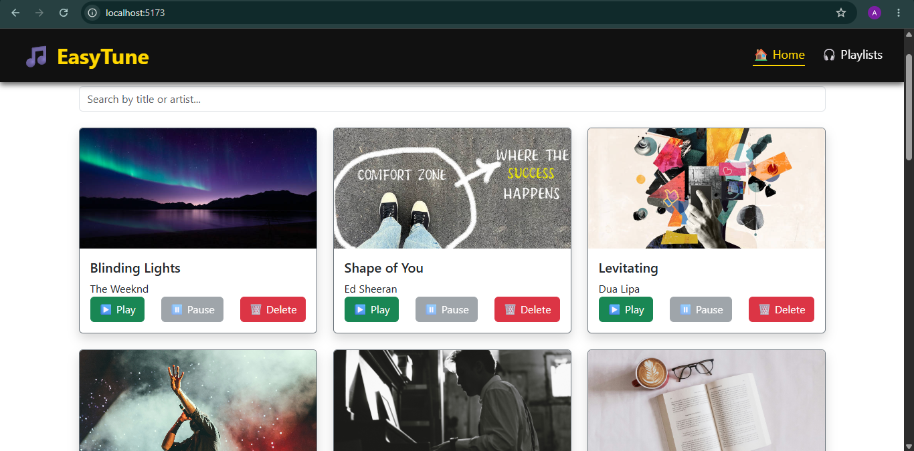
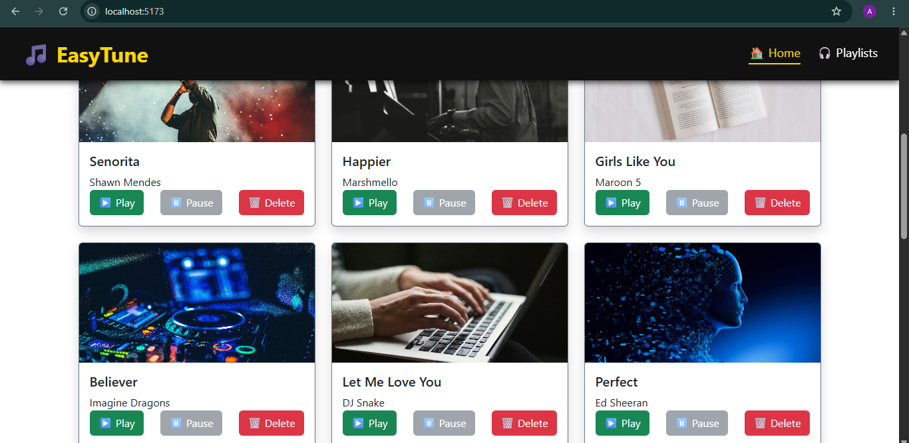
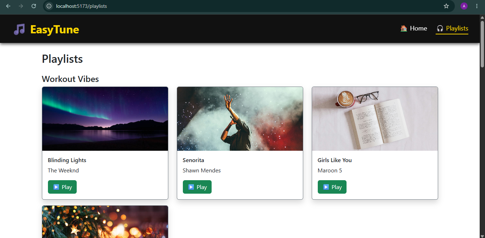
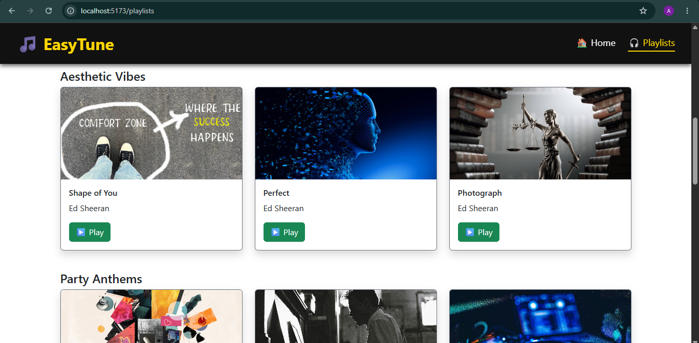
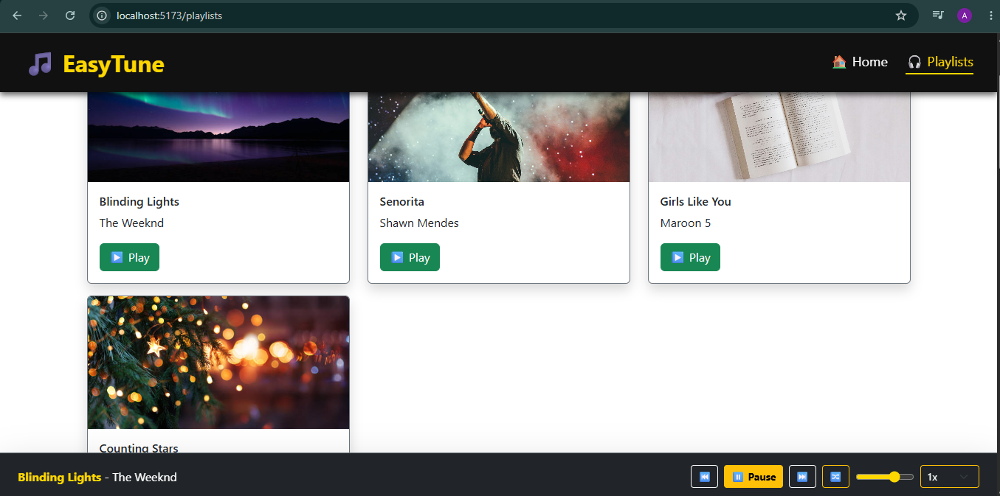

## 🎵 EasyTune

EasyTune is a responsive music streaming web application built with React and Vite. The application allows users to browse songs, explore playlists, search for music, and control playback through an interactive music player interface.

## Features

* Browse and view songs
* Playlist management
* Search songs by title or artist
* Music playback controls (Play, Pause, Next, Previous)
* Responsive and user-friendly interface
* Dynamic data fetching using REST APIs
* Mock backend using JSON Server
* Navigation using React Router

## Technologies Used

* JavaScript (ES6+)
* React.js
* Vite
* React Router DOM
* Bootstrap
* React Bootstrap
* HTML5
* CSS3
* JSON Server
* REST APIs
* Component-Based Architecture

## Project Structure

easytune/
├── src/
│   ├── components/
│   ├── pages/
│   ├── assets/
│   ├── App.jsx
│   └── main.jsx
├── public/
├── db.json
├── package.json
├── index.html
└── README.md

 
## Installation and Setup

### 1. Clone the repository

git clone https://github.com/armishiqbal/EasyTune.git
cd EasyTune

### 2. Install dependencies

npm install

### 3. Start JSON Server

npx json-server --watch db.json --port 3001

### 4. Run the application

npm run dev

### 5. Open in browser

http://localhost:5173/

## API Endpoints

| Method | Endpoint     | Description         |
| ------ | ------------ | ------------------- |
| GET    | `/songs`     | Fetch all songs     |
| GET    | `/playlists` | Fetch all playlists |
| DELETE | `/songs/:id` | Delete a song       |

## Screenshots

### Home Page

### Songs Page

### Playlist Page

### Playlists Page

### Music Player

## Author

Armish Iqbal
BS Computer Science Student
Islamia University Bahawalpur

